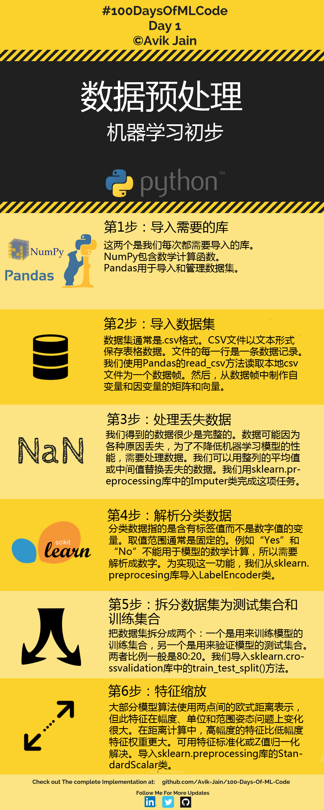

# 数据预处理  
  

如图所示，通过6步完成数据预处理。  
此例用到的数据，代码。  
## 第1步：导入库  
```
import numpy as np
import pandas as pd
```
## 第2步：导入数据集  
```
dataset = pd.read_csv('Data.csv')//读取CSV文件
X = dataset.iloc[:,:-1].values   //.iloc[行,列]
Y = dataset.iloc[:,3].values     //:全部行 or 列；[a]第a行 or 列
                                 //[a,b,c]第a,b,c 行 or 列
```
## 第3步：处理丢失数据  


